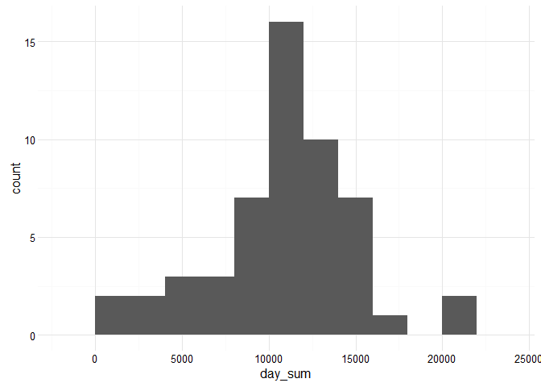
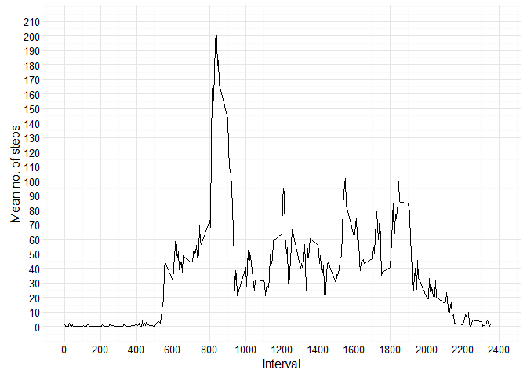
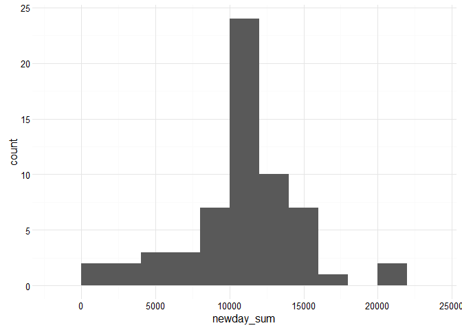
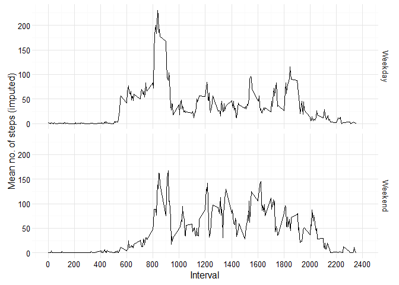

# Reproducible Research: Peer Assessment 1

###Loading and preprocessing the data

1. Load the data  
Loads the data from our working directory:

```r
data <- read.csv("activity.csv")
```

2. Process/transform the data (if necessary) into a format suitable for your analysis  
Transforming the data variable into date format might be useful:

```r
data$date <- as.Date(data$date)
```

###What is mean total number of steps taken per day?
1. Calculate the total number of steps taken per day

```r
day_sum <- tapply(data$steps, data$date, sum)
```

2. Make a histogram of the total number of steps taken each day

```r
library(ggplot2)
```

```
## Warning: package 'ggplot2' was built under R version 3.1.3
```

```r
ggplot(as.data.frame(day_sum), aes(day_sum)) + geom_histogram(binwidth=2000) + theme_minimal()
```

```
## Warning: Removed 8 rows containing non-finite values (stat_bin).
```



3. Calculate and report the mean and median of the total number of steps taken per day

```r
mean(day_sum, na.rm=TRUE)
```

```
## [1] 10766.19
```

```r
median(day_sum, na.rm=TRUE)
```

```
## [1] 10765
```

###What is the average daily activity pattern?  
1. Make a time series plot of the 5-minute interval (x-axis) and the average number of steps taken, averaged across all days (y-axis)

```r
interval_means <- tapply(data$steps, data$interval, FUN=mean, na.rm=TRUE)
ggplot(as.data.frame(interval_means), aes(x=as.numeric(row.names(interval_means)), 
    y=interval_means)) + geom_line() + 
    xlab("Interval") + ylab("Mean no. of steps") + 
    scale_x_continuous(limits=c(0, 2400), breaks=seq(0, 2400, by=200)) +
    scale_y_continuous(limits=c(0, 210), breaks=seq(0, 210, by=10)) +
    theme_minimal()
```



2. Which 5-minute interval, on average across all the days in the dataset, contains the maximum number of steps?

```r
interval_means[which.max(interval_means)]
```

```
##      835 
## 206.1698
```
The interval begining at minute 835 appears to have a average number of steps of 206 which is the maximum.

###Imputing missing values
1. Calculate and report the total number of missing values in the dataset

```r
sum(is.na(data$steps))
```

```
## [1] 2304
```
2. Devise a strategy for filling in all of the missing values in the dataset.  
A sensible strategy seems to be to substitute NA's with the average number of steps for that time interval. Number of steps varies greately over time of the day, so for instance a night time missing value should be substituted with a reasonable number for that time of the day.

3. Create a new dataset that is equal to the original dataset but with the missing data filled in.

```r
# Convert the named vector of interval means to a dataframe, for later merging.
interval_means <- as.data.frame(interval_means)
interval_means$interval <- row.names(interval_means)

# Create a new dataset with a separate column for interval means
newdata <- merge(data, interval_means, all.x = TRUE)

# Identify missing values in steps and substitute with mean value for that interval
missingSteps <- is.na(newdata$steps)
newdata$steps[missingSteps] <- newdata$interval_means[missingSteps]
```

4. Make a histogram of the total number of steps taken each day and Calculate and report the mean and median total number of steps taken per day. Do these values differ from the estimates from the first part of the assignment? What is the impact of imputing missing data on the estimates of the total daily number of steps?


```r
newday_sum <- tapply(newdata$steps, newdata$date, sum)
ggplot(as.data.frame(newday_sum), aes(newday_sum)) + geom_histogram(binwidth=2000) + theme_minimal()
```



```r
mean(newday_sum, na.rm=TRUE)
```

```
## [1] 10766.19
```

```r
median(newday_sum, na.rm=TRUE)
```

```
## [1] 10766.19
```
The mean number of steps over intervals is of course not affected by substituting NA's with those same means. The median is only very slightly affected and is now identical to the median, as it is an imputed value.

###Are there differences in activity patterns between weekdays and weekends?
1. Create a new factor variable in the dataset with two levels - "weekday" and "weekend" indicating whether a given date is a weekday or weekend day.

```r
newdata$weekday <- weekdays(newdata$date)
day_means <- tapply(newdata$steps, newdata$weekday, FUN=mean, na.rm=TRUE)
weekend_days <- (newdata$weekday == "lørdag" | newdata$weekday == "søndag")
newdata$weekend[weekend_days] <- "Weekend"
newdata$weekend[!weekend_days] <- "Weekday"
```

2. Make a panel plot containing a time series plot of the 5-minute interval (x-axis) and the average number of steps taken, averaged across all weekday days or weekend days (y-axis). 

```r
ggplot(newdata, aes(x=interval, y=steps)) + 
    xlab("Interval") + ylab("Mean no. of steps (imputed)") + 
    stat_summary(fun.y="mean", geom="line") +
    scale_x_continuous(limits=c(0, 2400), breaks=seq(0, 2400, by=200)) +
    facet_grid(weekend ~ .) +
    theme_minimal()
```


